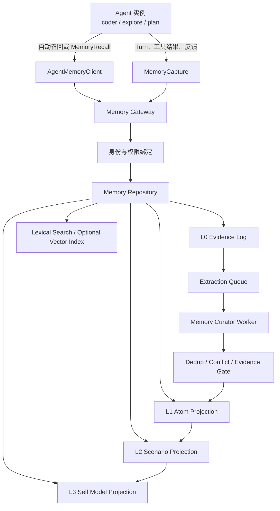
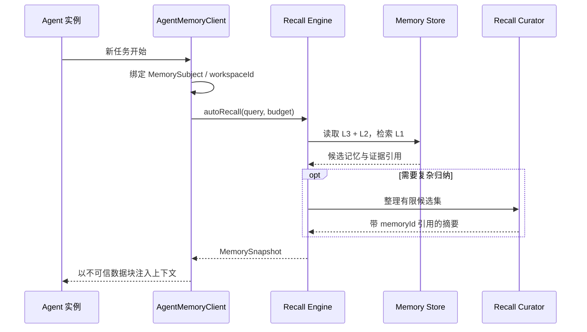
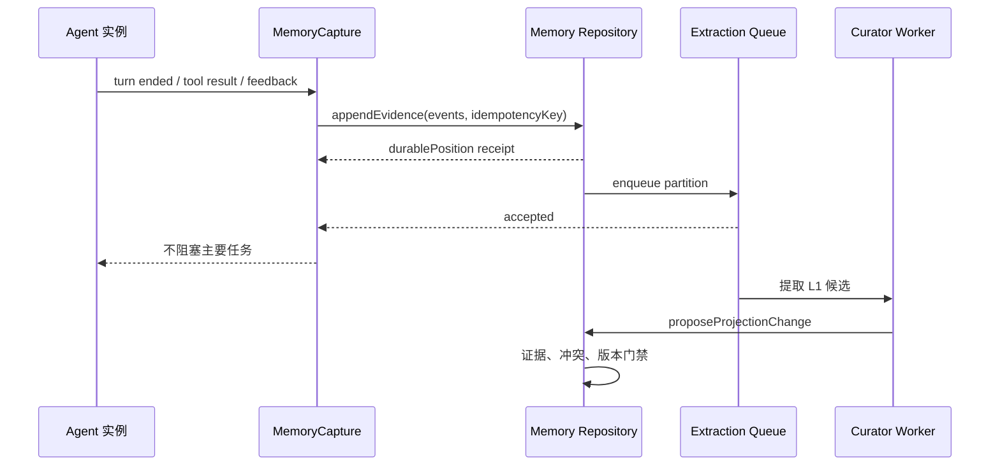

# 总体架构

本页定义 Agent Profile 共享记忆系统的边界和组件关系。系统需要同时满足两个目标：让同一 Profile 的并发实例继承共同经验，并防止未经验证的单次经历直接污染长期能力和人格。

> **范围标记：** 本页同时描述目标架构与 MVP。当前可编码范围只有 builtin `coder`、Workspace 级 L0/L1、本地单 writer、手动 Recall；图中的 L2/L3、跨 Workspace/global、外部镜像和多进程 Worker 都是后续演进，不得由首轮工作包顺手实现。

## 目标与约束

系统必须满足以下核心不变量：

1. `MemorySubject` 由可信运行时根据部署/租户主体、Profile 来源、稳定 owner ID、owner epoch 和 Workspace 解析，Agent 不能在请求参数中伪造。
2. 同一可信主体下的所有内置 `coder` 实例共享一份逻辑记忆，但项目知识继续按 `workspaceId` 隔离；同名自定义 Profile 不自动加入。
3. L0 在保留或删除命令之前以只追加方式保存，是权威证据；任何 L1–L3 结论都必须能够追溯到 L0。
4. Memory Agent 不能直接修改数据库，只能通过受约束的 Memory Service 命令提交投影变更。
5. 普通 Agent 不能把任务文本、猜测或自我评价直接写成永久事实。
6. 检索索引和 L1–L3 投影损坏后必须能够从 L0 重建。
7. 记忆系统不可用时，Agent 仍应能够完成不依赖历史记忆的主要任务。

## 逻辑组件



各组件职责如下：

- **AgentMemoryClient**：Agent Scope 的调用门面，自动绑定当前 Profile、工作区、会话和实例来源。
- **MemoryCapture**：监听已完成的轮次和确定性运行结果，把事件转成 L0 证据。
- **Memory Gateway**：统一执行认证、限流、预算、幂等、版本检查和请求路由。
- **Memory Repository**：记忆领域的唯一写入权威，隐藏 Store、索引和外部后端差异。
- **Extraction Queue**：异步调度 L1–L3 提炼任务，按记忆分区保证顺序。
- **Memory Curator Worker**：受限 LLM Worker，只处理给定候选材料，不拥有任意文件或数据库权限。
- **Evidence Gate**：验证引用、作用域、冲突和状态转换，拒绝无证据晋升。
- **Recall Engine**：执行分层检索、融合排序、预算裁剪和安全包装。

## Memory Agent 的逻辑身份

Memory Agent 是一个统一的逻辑角色，不应实现成全系统唯一的常驻 LLM 实例。单实例会形成性能瓶颈、故障单点和串行锁；推荐将逻辑角色拆成无状态 Worker：

```text
Memory Agent
├─ Recall Curator Worker × N
├─ L1 Extraction Worker × N
├─ L2 Scenario Worker × N
├─ L3 Self-Model Worker × N
└─ Evaluation Worker × N
```

Worker 共享同一套系统提示词版本、数据契约和 Memory Repository。MVP 在一个本地 writer 进程内串行处理每个分区，但首版仍需 lease ID 和分区单调 fencing token，防止 lease 过期重领后的旧 Worker 晚提交；多进程还要增加跨进程锁/CAS 证明。同一 `memoryOwnerId + workspaceId` 的 L2 更新通过队列串行化，L3 则按 `memoryOwnerId` 串行化。

## 身份与作用域

长期身份和运行时身份必须分离：

```ts
export interface MemoryInvocationContext {
  readonly requestId: string;
  readonly principalId: string;       // 认证主体；本地 MVP 为安装级主体
  readonly memoryOwnerId: string;     // 例如受保护的 "builtin:coder"
  readonly ownerEpoch: number;        // MVP builtin coder 固定 0；未来删除治理递增
  readonly profileName: string;       // 显示名，不单独作为存储身份
  readonly profileSourceId: string;   // builtin/plugin/user/workspace 等胜出来源
  readonly workspaceId: string;
  readonly rootBindingId: string;     // canonical root 的 opaque 绑定，参与 Workspace 分区
  readonly sessionId?: string;        // runtime/tool 调用存在；operator 可省略
  readonly runtimeAgentId?: string;   // runtime/tool 调用存在；operator 可省略
  readonly taskId?: string;
  readonly turnId?: number;
  readonly source: 'runtime' | 'agent-tool' | 'worker' | 'operator';
}
```

这是内部可信调用上下文，不是模型工具输入。身份和 Scope 字段不能由模型提供；runtime Capture 使用的 Evidence provenance 是更严格的独立 Schema，要求 `sessionId` 和 `runtimeAgentId`。`IAgentMemoryClient` 应使用 Profile 绑定时已经解析并冻结的 `MemorySubject`，而不是只读取 `IAgentProfileService.data().profileName`。

当前 Session Profile Catalog 的 `inspect(name)` 才同时持有胜出 Profile 与 `sourceId`，而现有 `profile.bind` / `ProfileBindingSnapshot` 只保存 `profileName`。WP1 必须冻结一个不可拆分的 `ResolvedAgentProfileBinding { profile, sourceId }`（或等价 branded 类型）：`bind/useProfile/applyProfile`、fork snapshot、新写 Wire 和恢复后的 refresh 只允许消费或保留这个整体。初次按名称绑定只调用一次 `inspection = catalog.inspect(name)`，直接使用其中的 `profile` 和 `sourceId`；不得以 `get()` + `inspect()` 双读取制造 TOCTOU。Wire 字段为兼容旧回放可以 optional，但所有新 bind/fork 在 Service 边界必填。恢复后必须验证持久 source-addressed binding；当前 Catalog 无法证明同一来源时保持 fail closed并关闭 refresh/Memory，绝不能按当前同名 winner 切换。旧记录没有来源时只关闭记忆而不阻断 Session 回放，显式迁移另开工作包。

完整形态的一份 Profile 记忆可以包含三种适用范围；MVP 只启用 `workspace`：

| 适用范围 | 键 | 用途 | 默认召回 |
| --- | --- | --- | --- |
| `global` | `principalId + memoryOwnerId + ownerEpoch` | 跨项目稳定能力、自我模型、通用方法 | MVP 关闭 |
| `workspace` | 上述字段 + `workspaceId + rootBindingId` | 项目事实、架构约束、项目经验 | MVP 唯一长期范围 |
| `session` | 上述字段 + `workspaceId + rootBindingId + sessionId` | 未沉淀的近期经历和恢复信息 | 仅作 L0 分区/来源，不作为共享召回范围 |

第一版不允许普通 Agent 将 `workspace` 记忆直接晋升为 `global`。跨作用域晋升必须由 Evaluator 依据多个独立工作区的证据完成，或经过人工确认。

## v2 Scope 布局

Scope 只决定运行时 Service 的身份和生命周期；长期数据仍由持久 Store 保存。

```text
App Scope（由 `ProfileMemoryFeature` 贡献）
├─ IWorkspaceTrustAuthority（Trust Domain；按 canonical record key 的状态机 / cross-process mutex）
├─ IProfileMemoryWriterLease（首次启用时懒获取；同一 home 单写者）
├─ IProfileMemoryRepository
├─ IProfileMemoryEvidenceStore
├─ IProfileMemoryProjectionQueue
├─ IProfileMemorySearchStore
└─ IProfileMemoryWorkerLLM

Workspace Scope（保留现有公共 facade，不另建持久权威）
├─ workspaceId / workspace context
├─ IWorkspaceTrust（当前 Workspace handler 的 facade；不自有记录或 mutex）
└─ IWorkspaceProfileMemoryCoordinator（permit adapter / cancel / cache）

Session Scope（MVP 不预建 Profile Memory Service）
└─ sessionId 由调用方绑定；Capture checkpoint 持久化并以 sessionId 为业务键

Agent Scope
├─ IAgentProfileMemoryService
├─ IAgentProfileMemoryCaptureService
├─ MemoryRecall / MemoryPropose / MemoryFeedback 工具（到 WP8 才贡献）
└─ 当前 Turn 的 Snapshot / Recall cache
```

只有某一级确实拥有独立运行状态并需要生命周期钩子时，才新增 Workspace/Session Service。MVP 没有隐藏的“Memory Worker Agent”：投影由 App-scope 的受限 `IProfileMemoryWorkerLLM` 和耐久 Queue 驱动。Backend registry、global projection 和跨 Workspace 缓存均属于后续需求，首版不预建空抽象。

依赖方向是短生命周期指向长生命周期；所有运行时能力放在 `src/features/profileMemory/`，配置与 Wire vocabulary 仍静态注册：

```text
IAgentProfileMemoryService @Agent
  ├─ trusted Profile binding
  └─ IWorkspaceProfileMemoryCoordinator @Workspace
       ├─ IWorkspaceTrust facade @Workspace
       │    └─ IWorkspaceTrustAuthority @App（按 canonical trust-record key）
       └─ IProfileMemoryRepository @App
            ├─ IProfileMemoryEvidenceStore
            ├─ IProfileMemoryProjectionQueue
            └─ IProfileMemorySearchStore
```

App Scope 的 Repository 不保存 `Map<sessionId, ...>` 形式的子 Scope 运行状态，也不能直接注入较短生命周期的 `IWorkspaceTrust`。Trust Domain 必须拆成 App `IWorkspaceTrustAuthority` 与 Workspace `IWorkspaceTrust` facade：Authority 先用 `IHostFileSystem.realpath(root)` 解析 symlink/dot segments，再以 `canonicalRoot = workspaceRootKey(realRoot)` 作为进程内等价类，并用 `v2-<sha256(utf8(canonicalRoot))>.json` 作为安全定长的持久 key、`rb-v1-<同一 digest>` 作为 opaque `rootBindingId`；解析失败 fail closed，不能把原始路径直接当 key。同一 canonicalRoot 的 legacy/alias workspace handler 共享该 entry 的 snapshot、异步 mutex 和 change broadcast。hardlink、bind mount、网络 inode 与设备特有 Unicode/case 规则不在首版等价保证内；改变规则需要版本化 key 和显式迁移。Facade 固定绑定词法 root、canonical root 与 rootBindingId 后转发权威 API，不得拥有实例级持久状态或第二把 mutex；每次安全 API 重新解析词法 root，发现 retarget/悬空时立即撤销旧 binding且不自动信任新 target。

Authority 在现有外部可信地址保存一份包含 `trusted + workspaceTrustEpoch + rootBindingId` 的版本化记录。每次 `trust/untrust/commitIfCurrent` 都通过通用 persistence `IExclusiveKeyLockStore` 取得 canonical record key 的跨进程锁，并在锁内重读记录与复验 `{rootBindingId, epoch}`；这样多个 Kimi 进程仍可安全串行修改 Workspace Trust，不会因为 Profile Memory Flag 关闭而失去现有 Trust 路由。Profile Memory 另有一个 home 级 `IProfileMemoryWriterLease`：首次 enabled 操作/permit 前懒获取，取得后持有到显式 `IProfileMemoryShutdown.drain()` 完成；第二个进程获取失败时仅 Profile Memory mutation/permit fail closed。初始 disabled 时不打开 Profile Memory Store、不申请该 lease。

Authority 对 canonical v2 record 的跨进程 watch/reconcile 是基础 Trust 生命周期的强制组成：entry 维护 `starting/healthy/degraded/disposed` 健康状态，事件只加速唤醒；即使 watcher 表面 healthy，也必须以可注入时钟在不超过 2 秒的固定上界内进入 record lock 重读，防止静默漏事件。watch error/close、周期 reconcile 超时或读取失败都原子进入 degraded、按 untrusted 撤销并重订阅，当前订阅首次 reconcile 完成前不得回到 healthy。`WorkspaceMcpConfigService` 的初始化和 reload 必须使用 package-private guarded project access，只在“record trusted + watch healthy”时取得冻结 canonical root，并让 loader、file watch 与 project-origin stdio cwd 全链使用该 root，读取后再调用 capability 的 `validateAfterRead()`；不能用同步 `isTrusted()`、普通 `getSnapshot()` 或可 retarget 的词法 root 决定 project MCP。撤销必须走不排在普通 initialize/connect/apply tail 后的高优先级可取消通道：先 deny new use、abort/隔离 pending project connect，再卸载；无法取消的连接也先从可调用 registry 原子撤下后后台清理。这样即使底层没有发出 change/error/close或既有 connect 卡住，进程 A untrust 后进程 B 仍会在有界窗口内拒绝并卸载 project MCP，watch down 时不会因耐久记录仍为 true 而重开；Memory 的每次操作仍独立锁内复验，不把 watch 当最终安全检查。

两类锁复用同一个 persistence access-pattern primitive，但 namespace、粒度和生命周期不同，不能互相冒充。通用 node-fs backend 还必须让每次 atomic replacement 都执行 file fsync → rename → parent-directory fsync；业务 Trust Domain 不直接使用 `node:fs`。当前 `IAtomicDocumentStore.set()` 经 `FileStorageService.syncDirOnce()`，不能证明第二次及之后的 rename 已耐久，因此在修正 byte layer 前不能作为 epoch 线性化点。KAP 等调用方仍调用 Workspace facade 的 `IWorkspaceTrust.trust()/untrust()`，不能绕过它写记录；`onDidChange` 只用于通知，不承担 fence 的正确性。

Workspace coordinator 只消费 facade 并为每次操作签发仅内部可构造的 `WorkspaceMemoryPermit`；它先验证 home writer lease，再通过跨进程 record lock 重读权威记录后签发，不能只读 shared/cached snapshot。permit 带 `workspaceId`、`rootBindingId`、epoch、`AbortSignal`、异步 live check 和委托给 keyed Authority 的 `commit()` 能力，不属于 Zod/Tool/Wire Schema。普通 read 返回前必须再次异步锁内复验；`AbortSignal` 只用于尽快取消。`untrust()` 在该 canonical key 的共享 mutex 中读取最新耐久记录，写入并全耐久同步 `trusted=false, epoch=epoch+1`，再更新共享 snapshot 和广播通知；所有 alias facade/coordinator 随后 abort 尚未 commit 的工作并清缓存。`trust()` 同锁读取最新记录后写 true，但保留 epoch。重启、重新 trust、handler 重建或 workspaceId 别名都不会把 epoch 归零，避免 ABA；root retarget 后必须显式 materialize/重新 trust 新 binding，A 的分区不迁移到 B。

App Store/Queue 在最终写入或 ack 时必须通过 permit 的 `commit()` 临界区执行；permit 只有在 home 级 Profile Memory writer lease 有效时才能签发。`commit()` 委托 facade，再由 keyed Authority 取得 canonical record key 的跨进程锁、重读最新耐久记录并校验 `trusted && epoch === expectedEpoch`，随后持锁到领域 effect 的耐久点完成。已经进入临界区的写入在线性化语义上发生于新 epoch 落盘之前，允许完成；尚未进入的旧 permit 全部失败。这样不需要假装能撤销已经落盘的原子写，同时保证 `untrust()` 之后不会再接纳旧 epoch。句柄失联、Workspace handler 不存在、Profile Memory writer lease 无效或 epoch 不匹配一律 fail closed。

全局锁序冻结为“先验证已长期持有的 home writer lease，再取 canonical-key 进程内 mutex，再取短持有的 canonical record lock，最后才取 Queue/Evidence/Projection 等领域锁”；effect 开始前再次验证 writer lease。持有领域/partition lock 时禁止调用 Trust、获取 permit 或等待 lease；Worker 先无锁/短锁 peek并释放，再用 `permit.commit()` 包住仍获授权的业务 mutation。已 untrusted、root drift 或旧 `{rootBindingId, epoch}` job 不能取得普通 permit：Authority/coordinator 只能返回精确绑定 `jobId + workspaceId + rootBindingId + workspaceTrustEpoch` 的 package-private branded `WorkspaceRevocationProof`。Queue 的 `fenceRevoked(jobId, expectedState, proof)` 必须在 partition lock 内重读 job，确认 job ID、目标三元组及 active lease/fencing state 与 proof/expectedState 完全匹配，才可做 `pending|leased -> fenced`；错配拒绝，proof 不可跨目标重放。Projection commit 与 success ack 的类型不接受该 proof，也不存在任意 callback effect。handler 不存在且无法证明时持久退避/隔离，不热循环。record-lock effect 不得递归进入 Trust API 或同时持有第二个 record lock。长 lease 以 owner token/PID 确认所有权，活着的 owner 不得仅因超时/暂停被接管，并暴露 loss `AbortSignal`。由于当前 Scope dispose 不 await Ledger，Feature 还要提供 App `drain()`：停止新操作、等待在途 commit/Worker、await lease release；KAP、ACP、SDK、CLI 与 harness 等所有 v2 composition root 必须先 await drain，再同步 dispose。基础 Workspace Trust mutation 不申请 Memory lease，因此 Feature disabled 或第二 writer 不会破坏 trust route。

App-scope 后台调度从耐久记录取得 `workspaceId + rootBindingId + workspaceTrustEpoch`，经 `IWorkspaceLifecycleService.handlerFor({ workspaceId })` 取得对应 handler，再从 `handler.accessor` 取得 coordinator并复验 binding 后 claim；不得直接注入 `IWorkspaceTrust`，不得缓存 trust bool，也不得仅相信入队时状态。Capture 的来源 checkpoint 是按 Session/source stream 业务键持久化的数据，本轮召回缓存属于 Agent Scope。

## 主要数据流

### 任务开始时召回



### 任务结束后保存



### Agent 主动查询

主动查询是需要返回值的命令，应使用直接调用，而不是通过事件模拟 request/reply：

```text
Agent → MemoryRecall Tool → IAgentProfileMemoryService
      → IProfileMemoryRepository
      → Recall Engine → 结构化结果
```

事件只用于公布已经发生的事实，例如 `memory.evidence.appended`、`memory.atom.promoted` 和 `memory.projection.failed`。

## 部署模式

完整系统可以支持外部镜像，但 MVP 只有一个本地权威源，并保持 Agent 工具协议后端中立。

### TencentDB Agent Memory 镜像（MVP 之后）

需要复用独立记忆服务时，可通过适配器对接 TencentDB Agent Memory：

- 由本地映射表把可信 `MemorySubject` provision 成 `agent_id`、`user_id` 和 `team_id`，不直接透传裸 Profile/Workspace 名称。
- `runtimeAgentId` 写入扩展元数据，不作为隔离键。
- 第一版镜像只覆盖 L0/L1 Conversation/Atomic 检索，本地仍是写入和恢复权威。
- L2/L3 继续由本地投影负责，直到外部隔离、版本和删除语义通过 Contract Suite。
- 只对接具备严格 team/agent/user/session 隔离的 v3 能力，不降级到默认桶。

### 本地原生后端

MVP 默认先以本地模式建立权威契约和可恢复基线，并使用现有持久化层：

- 领域专用 `IProfileMemoryEvidenceStore` 在现有持久化原语之上提供 awaited append、opaque position 和逐事件幂等；Capture source checkpoint 由 WP5 独立维护。
- 领域 Queue 保存任务、分区头、重试和 DLQ；进程事件只用于唤醒。
- `IProfileMemorySearchStore` 保存 L1 查询投影并提供可替换的词法搜索契约。
- 向量索引是可选加速层，不影响权威数据恢复。

## 成功标准

系统上线后，至少应能证明：

- 两个并发 `coder` 实例能读取相同的 Profile 记忆。
- `coder` 无法读取 `explore` 的私有 Profile 记忆。
- `kimi-code` 工作区事实不会默认出现在其他工作区。
- 一次偶然成功只能生成候选经历，不能直接晋升为全局能力。
- 召回结果中的每个稳定结论都能定位到 L0 证据。
- 删除 L1–L3 和索引后，可以从 L0 重建等价投影。
- Memory Agent 超时或不可用时，普通 Agent 能以无记忆模式继续工作。
